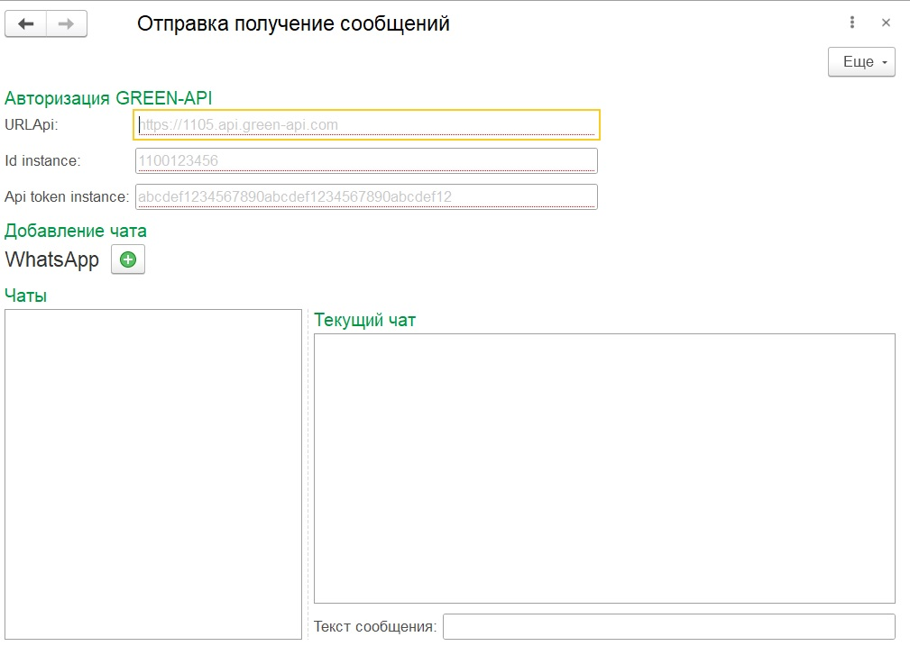

### Внешняя обработка 1с для отправки и получения сообщения в WhatsApp
Работает через сервис GreenApi

Нужно зайти в 1С в режиме Предприятие

Запустить внешнюю обработку «Файл – Открыть...»

Ввести свои учетные данные из системы GREEN-API (URL Api, idInstance, apiTokenInstance)

Нажать в разделе добавления чата на "+" и ввести номер телефона в формате +7900 123 45 67

В поле "Текст сообщения" ввести отправляемый текст и нажать "Enter". 

При успешной отправке, отправленный текст отобразится в поле "Текущий чат"

После отправки с номера, который был указан в добавленном чате, отправить ответное сообщение

Ответное сообщение отобразится в текущем чате
